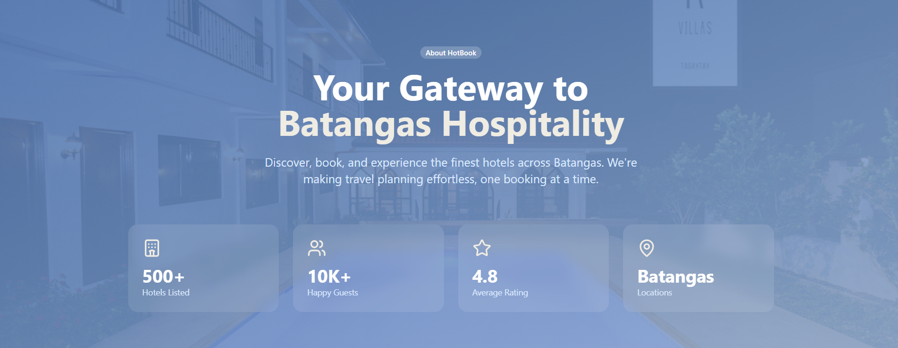
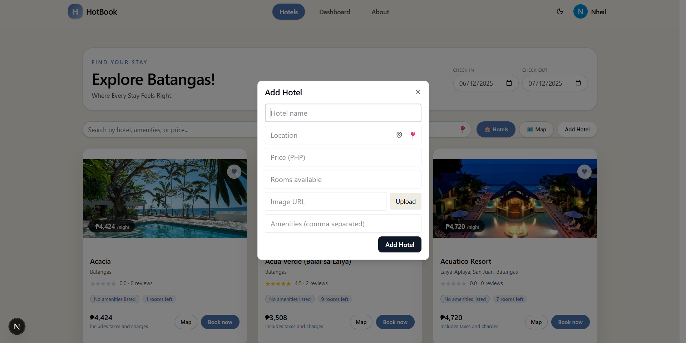
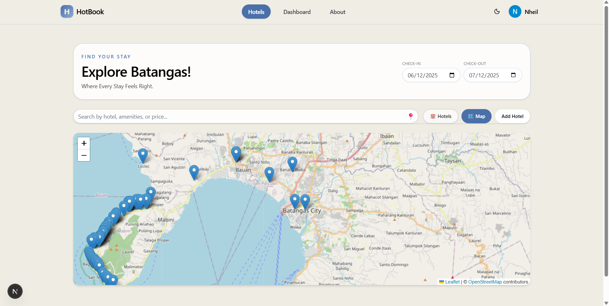
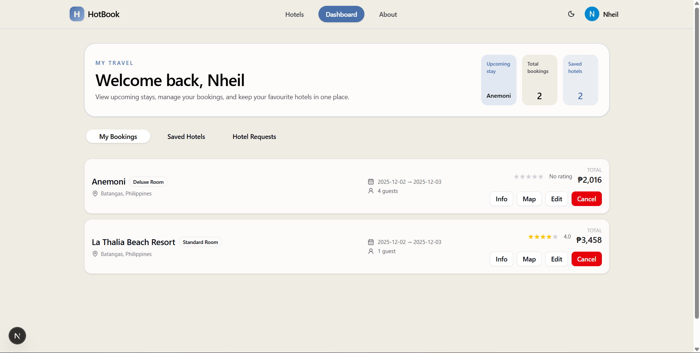
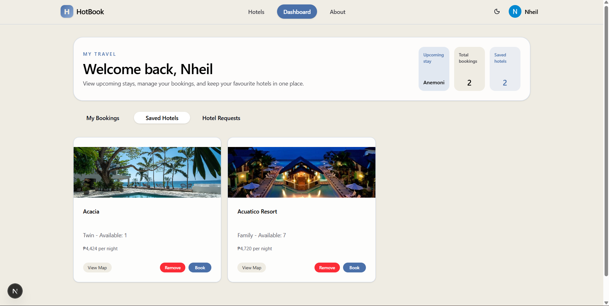
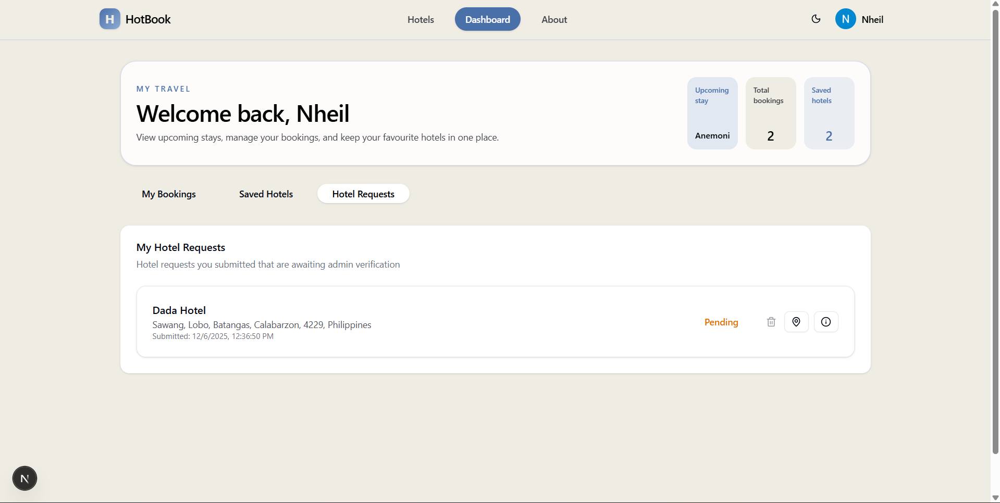
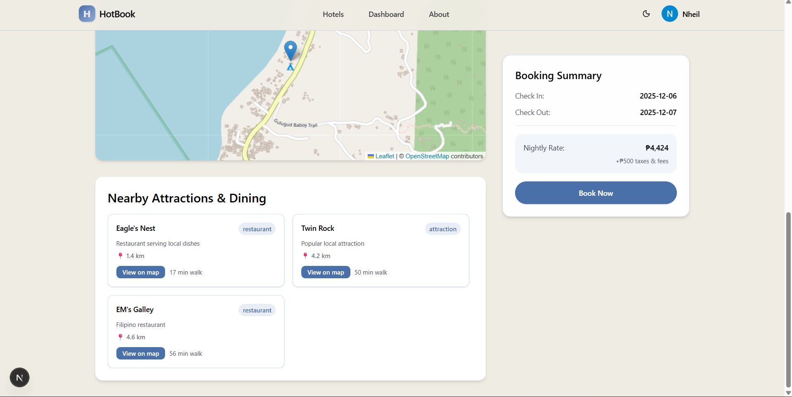
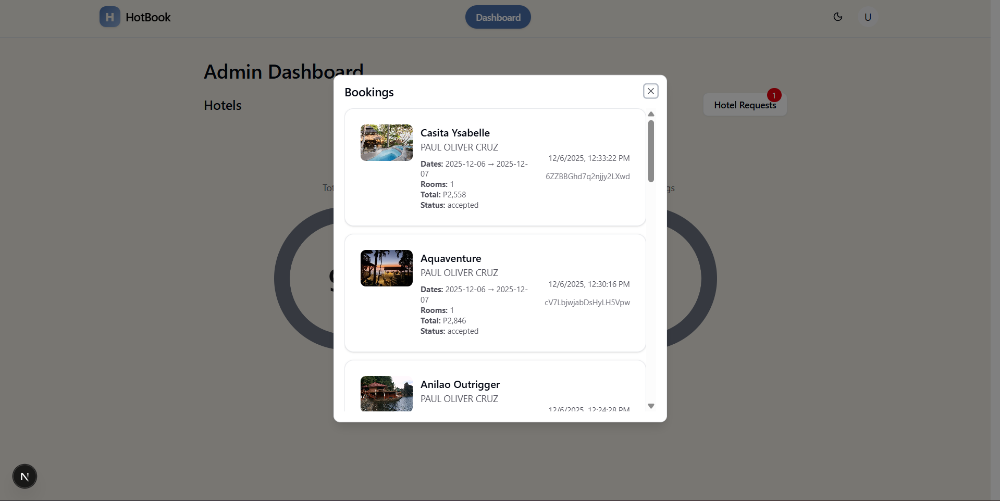
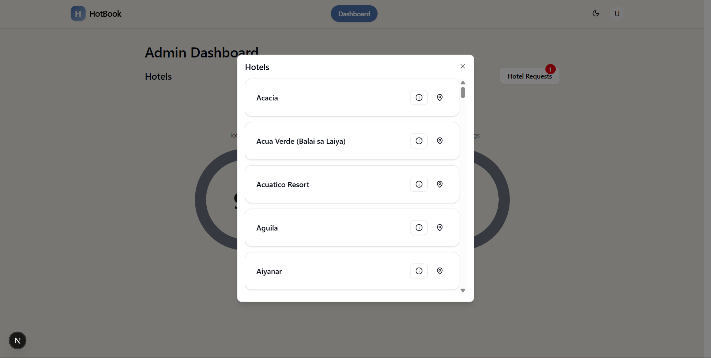
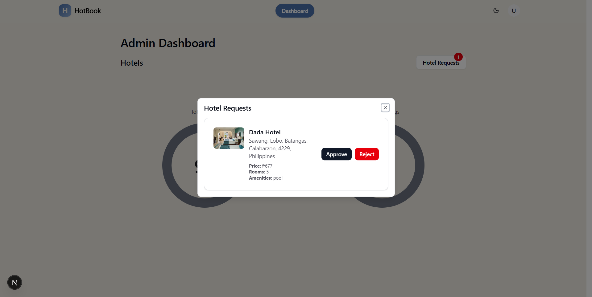

# HotBook: An Intelligent and Flexible Hotel Booking Platform



This project presents an innovative Hotel Booking Web Application that enhances the traditional booking experience through artificial intelligence and dynamic pricing technology. The system integrates an AI Trip Curator that personalizes travel recommendations based on user interests, and a FlexiStay Optimization feature that allows flexible stay durations with real-time price adjustments. By combining convenience, personalization, and flexibility, this platform aims to redefine how travelers plan and book accommodations.

## Overview

HotBook is a demo hotel booking application built with Next.js (App Router). It showcases hotel listings, a booking flow, nearby recommendations (via Ollama / OpenAI fallback + Overpass), and Firebase authentication for Google sign-in.

## Features
- Hotel list with card/map view
- Hotel details + nearby recommendations
- Booking modal and pending bookings store
- Google sign-in (Firebase Auth)
- Ollama (local) integration for recommendations, with OpenAI fallback

## Quickstart — Local development

Prerequisites:
- Node 18+ and a package manager (npm/yarn/pnpm)
- Optional: Ollama (if you want LLM-powered recommendations) — https://ollama.ai

1. Clone the repo

```bash
git clone https://github.com/Cerphh/hotel-booking-app.git
cd hotel-booking-app
```

2. Install dependencies

```bash
npm install
# or: pnpm install
```

3. Create `.env.local` (optional values shown)

```env
# Ollama (local LLM server) — defaults to http://localhost:11434
NEXT_PUBLIC_OLLAMA_API=http://localhost:11434
NEXT_PUBLIC_OLLAMA_MODEL=mistral

# (Optional) OpenAI fallback for server-side recommendation debugging
# OPENAI_API_KEY=sk-...
# OPENAI_MODEL=gpt-4o-mini
```

4. Start Ollama (if using it)

```bash
# in a separate terminal
ollama serve
ollama pull mistral
```

5. Run the dev server

```bash
npm run dev
```

Open http://localhost:3000

## Notes
- Bookings are stored in an in-memory pending store for demo purposes (`app/api/pending`).
- Firebase config is currently embedded in `lib/firebase.ts`.

---


## Background
Traditional hotel booking platforms focus primarily on reserving rooms for fixed durations, offering limited personalization or integration with travel planning. Modern travelers, however, increasingly seek customized experiences and flexible arrangements that fit their schedules and preferences.

To address these gaps:

- The **AI Trip Curator** leverages artificial intelligence to generate tailored itineraries that include nearby attractions, restaurants, and local experiences.

- The **FlexiStay Optimization** system introduces a pay-by-hour or dynamic duration model, enabling users to book rooms for shorter or custom timeframes.

This dual innovation bridges the gap between hotel booking, itinerary planning, and flexible pricing, providing travelers with a more efficient and enjoyable journey experience.

## Objectives

- Develop an intelligent hotel booking platform that personalizes user experiences.

- Integrate the AI Trip Curator to automatically generate day itineraries based on user preferences, trip duration, and location.

- Implement FlexiStay Optimization to allow flexible booking durations (e.g., hourly or custom stay periods).

- Enhance user satisfaction by offering convenience, flexibility, and meaningful recommendations.

- Promote local tourism and businesses by featuring nearby attractions and establishments.

## Methodology

### System Design & Development

- Develop the hotel booking system using a full-stack web framework (Next.js / React / Node.js).

- Integrate hotel data, availability, and pricing modules.

### AI Trip Curator Module

- Use AI algorithms and APIs (e.g., Google Places, OpenAI API, or custom ML models) to recommend attractions, dining spots, and hidden gems.

- Analyze user preferences and previous bookings to tailor recommendations.

- Generate a suggested daily itinerary automatically based on location and available time.

### FlexiStay Optimization

- Implement dynamic pricing logic for hourly or partial-day bookings.

- Use time-based rate calculations and real-time room availability data.

- Include booking options for 6-hour, 8-hour, or custom durations.

### Testing and User Feedback

- Conduct usability testing to ensure smooth booking flow and accurate AI suggestions.

- Collect feedback from test users to refine pricing and itinerary features.

### Deployment

- Host the web application on a cloud platform (e.g., AWS, Firebase, or Azure).

- Ensure responsive design for mobile and desktop users.

## Expected Outputs

- A functional hotel booking website with integrated AI and dynamic pricing features.

- AI Trip Curator module that generates personalized travel itineraries for booked destinations.

- FlexiStay Optimization feature that enables hourly or flexible stay booking with automated price adjustments.

- Enhanced user experience, increasing engagement, satisfaction, and booking conversions.

- Support for local tourism by promoting nearby attractions and businesses.

Documentation:

- Developer guide & quick notes: `PROJECT_DOCUMENTATION.md`
- Technical deep-dive: `TECHNICAL_DOCUMENTATION.md`

---

## FEATURES


- `addhotel_features`

	

	The Add Hotel screen shows the form and fields used to register a new property, including details, photos, and amenity toggles. The image highlights inline validation, image upload previews, and the map pin picker for setting the precise location. It demonstrates how hosts can quickly create listings that immediately populate the public hotel directory.


- `hotelmap_features`

	

	The Hotel Map view displays hotels geographically with clustering and interactive popups for each property. This screenshot emphasizes filtering controls and map-driven search, enabling users to visually explore options and open quick booking modals from map markers. The combination of card and map views helps users compare nearby choices at a glance.


- `mybookings_features`

	

	My Bookings presents a user's active and past reservations with status labels, dates, and quick actions (view, cancel). The image demonstrates clear grouping by upcoming and previous stays, plus contact and modification links for each booking. It focuses on a clean, trustworthy booking management experience for travellers.


- `savedhotel_features`

	

	Saved Hotels (favorites) shows properties the user has bookmarked for later, including quick access to price and map location. The screenshot highlights the saved list layout, easy removal, and one-click navigation to the hotel detail page. It underscores how users can curate a shortlist while planning their trip.


- `hotelrequest_features`

	

	The Hotel Request flow shows a form for suggesting a new hotel or requesting a booking that isn't listed, capturing details and preferred dates. The image emphasizes submission confirmation and request status feedback to the user. This feature enables users to inform admins of missing properties or special availability needs.


- `nearbyattractions_features`

	

	Nearby Attractions displays curated recommendations (AI-powered with local fallback) alongside a small map and short descriptions for each point of interest. The screenshot highlights how recommendations are presented in-context on a hotel detail page so guests can easily plan activities. It showcases the integration of LLM-driven suggestions with geographic data.

## ADMIN FEATURES


- `bookings_admin`

	

	The Bookings Admin screen lists pending and confirmed bookings with controls for approving, rejecting, or deleting entries. This image underscores administrative workflows for moderation and manual overrides, including quick access to booking details and customer contacts. It demonstrates how staff can manage booking lifecycle events efficiently.


- `hotels_admin`

	

	The Hotels Admin view provides listing management tools: edit metadata, update availability, and remove problematic entries. The screenshot highlights bulk actions and individual edit dialogs to keep the catalog accurate. It showcases the main control surface for curating the platform's inventory.


- `request_admin`

	

	The Request Admin panel surfaces user-submitted hotel requests and messages, with options to accept, follow up, or dismiss. The image emphasizes the triage workflow and status tracking for incoming requests. It helps illustrate how admins respond to community-sourced additions and feedback.

